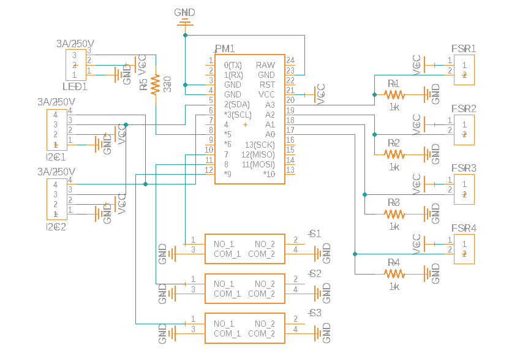

# FSR-DDR-Pad
An arduino micro based mini FSR DDR Pad made for my UCR EE120B embedded systems course. The input uses 4 Force-Sensitive Resistors and the user can use the 3 button on the PCB board along with the LED screen to adjust the settings of the pad.

# Schematic

# Image 

